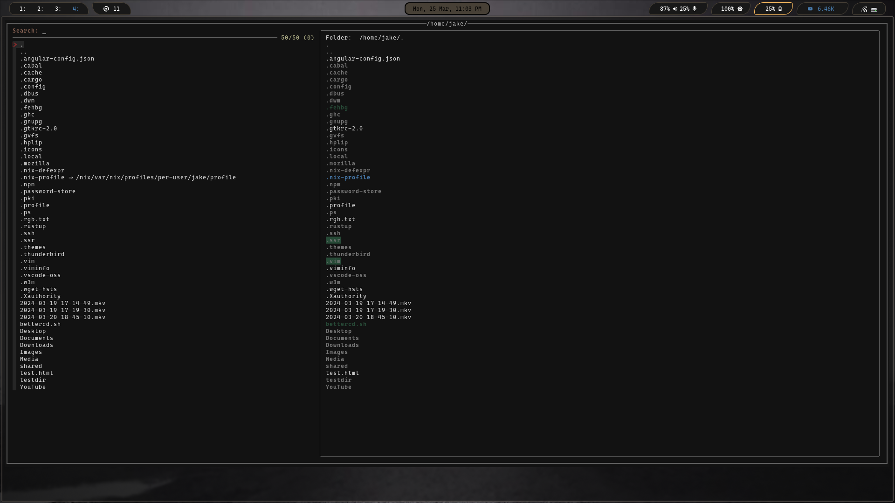

# Fzfm - Fuzzy file manager
This is a terminal file manager in the style of Ranger, nnn, lf, vifm, etc. It uses bash, fzf, and chafa
to display directory contents, preview the contents of the selected directory or file before entering
or opening, and preview images (poorly). 

### Installation
- Clone repo
- cd into fzfm
- chmod +x all scripts in fzfm dir
- Add to path if not already in a dir that is in your path (only necessary if you don't want to have to type entire path to script when running)

### Dependencies (for the script to work)
- fzf
- chafa (for now, working to get ueberzug or ueberzugpp working)

### Dependencies (for extra functionality, or edit script to use programs of your choice)
- libreoffice (for opening word docs)
- zathura (for opening PDFs)
- mpv (for video)
- sxiv (for images)
- neovim/vim (for editing text files)
- gimp (for xcf files)

###  Does well
- traverse file tree 
- preview files and directories 
- open files using different software based on file type
- create new files and directories (creates then fine, just has unexpected behavior after creating, have to close script and relaunch)
- delete files/directories

### Does (needs work)
- image preview

### Does not...yet (TODO)
- extract/compress

### Known "bugs"
unexpecte behavior after creating a file or dir
